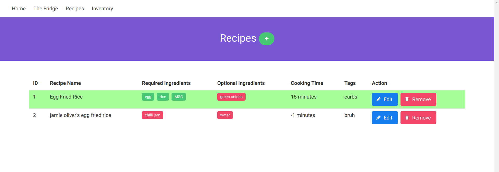

# The Kitchen

So you know sometimes you have too much stuff in your kitchen that you can't even remember what you have left in the fridge?

You know there are times when you can't decide what to cook for dinner?

Or when you have already decided to cook something but then find out you've run out of MSG to make egg fried rice?

The Kitchen is gonna solve that. Decentralized blockchain food management. I call it DeFo ;)

You can also use it to keep track of lunch boxes that you might have left to starved at the office.

Yeah. Don't do that.

